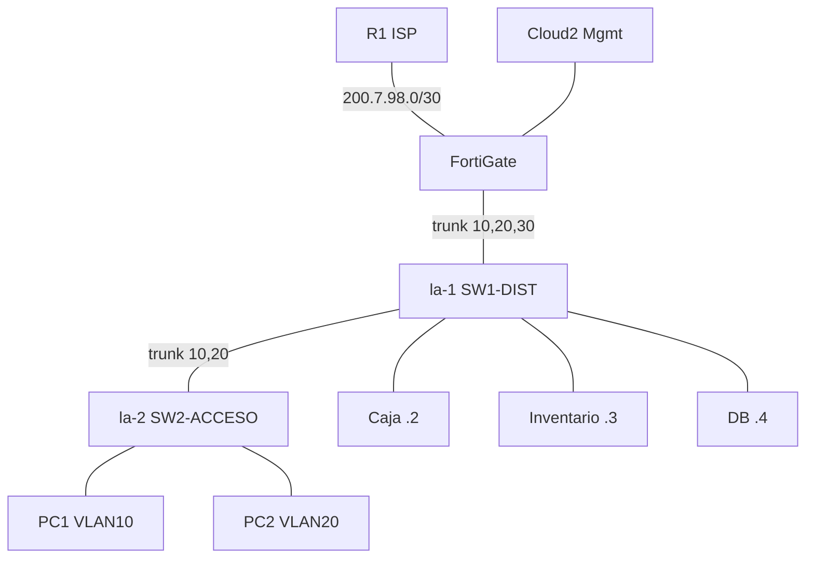

# P1 - Seguridad de Redes: DMZ segura con FortiGate

## Video demostrativo

> https://www.youtube.com/watch?v=yBpSE940f4U

---

**Estudiante:** Emmanuel Orlando Rodriguez | **Matricula:** 20250798 | **Plataforma:** GNS3

## Proposito del laboratorio

Implementar una red con una **DMZ** protegida por un **FortiGate** (configurado y demostrado 100 % por GUI) aplicando minimo privilegio:

- La DMZ no puede iniciar trafico hacia la LAN de usuarios.
- La DMZ no tiene Internet abierto: solo alcanza el endpoint de actualizacion simulado (`200.7.98.10`).
- Solo la **VLAN 20** puede administrar los servidores por SSH.
- La **VLAN 10** no puede usar el Sistema de Inventario y ve una **pagina de violacion de politica** del FortiGate.
- Los switches segmentan por VLAN y aplican la base de seguridad de capa 2.

## Topologia




### Direccionamiento (matricula 20250798: A=7, B=98)

| Red | Subred | Gateway |
|---|---|---|
| WAN R1 - FortiGate | 200.7.98.0/30 | R1 .1 / FG .2 |
| VLAN 10 | 10.7.98.0/25 | 10.7.98.1 (DHCP .10-.120) |
| VLAN 20 | 10.7.98.128/25 | 10.7.98.129 (DHCP .138-.250) |
| VLAN 30 DMZ | 192.168.98.0/28 | 192.168.98.1 (Caja .2, Inventario .3, DB .4) |

## Politicas del FortiGate


| # | Politica | Flujo | Accion |
|---|---|---|---|
| 1-2 | DENY-DMZ-A-LAN / -V20 | DMZ a v10 / v20 | DENY |
| 3 | ALLOW-DMZ-UPDATES | Servidores a 200.7.98.10 | ACCEPT + NAT |
| 4 | DENY-DMZ-A-INTERNET | DMZ a todo | DENY |
| 5 | DENY-SSH-VLAN10-A-SRV | v10 a servidores (SSH) | DENY |
| 6 | WEB-V10-INVENTARIO-BLOQUEADO | v10 a Inventario (HTTP) | ACCEPT + Web Filter |
| 7 | ALLOW-WEB-V10-CAJA | v10 a Caja | ACCEPT |
| 8 | ALLOW-USERS-INTERNET | v10 a WAN | ACCEPT + NAT |
| 9 | ALLOW-SSH-VLAN20-A-SRV | v20 a servidores (SSH) | ACCEPT |
| 10 | ALLOW-WEB-V20-SRV | v20 a Caja e Inventario | ACCEPT |


```
toda informacion extra dentro de la documentacion
